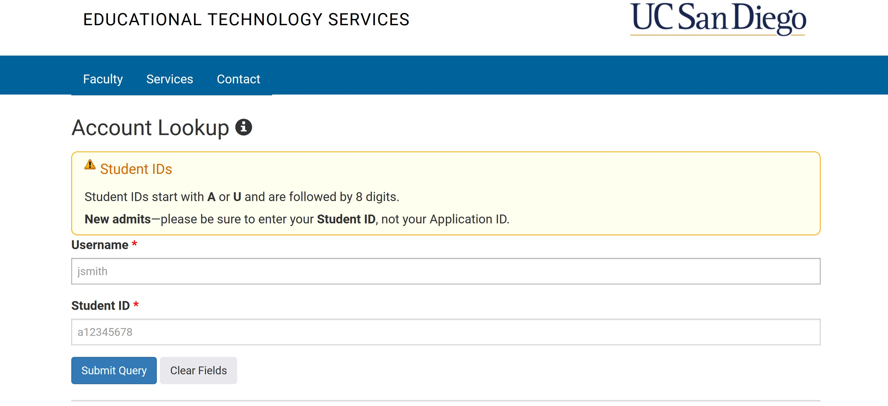
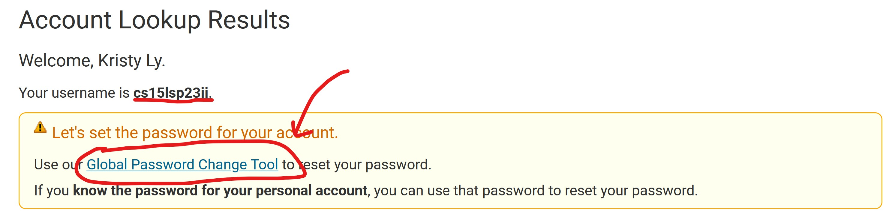

*Note: I could not access the remote computer due to IT issues*

# Remote Access & FileSystem 

## Step 1: Finding your CSE 15L Account
To find your CSE 15L account, open this [link](https://sdacs.ucsd.edu/~icc/index.php). In the section labeled **Account Lookup**, type in your UC San Diego username 
(It is the first part of your email, before the @ucsd.edu) and your PID. Then, click **Submit Query**.
You can also access the link here:
  
[https://sdacs.ucsd.edu/~icc/index.php](https://sdacs.ucsd.edu/~icc/index.php)

    


After logging in, you will see a section called **Additional Accounts**. In this section, click on the button that is labeled with **cs15lsp23**. This is your 
CSE 15L account username. Please note that each student has different letters after cs15lsp23, meaning that your account will most likely have two letters that is not 
ii. This does not impact anything, go ahead and click on the button.
  

  
In this page, you will see a box underneath your username that states:

```
Let's set the password for your account.
Use our Global Password Change Tool to reset your password.
If you know the password for your personal account, you can use that password to reset your password.
```

Click on **Global Password Change Tool**.
  

  
Now, you will see a section on the page called **Student, AX, or Course-Specific Student Accounts**. In this section, click **Proceed to the Password Change Tool**.


Make sure that this page is called **UC San Diego Active Directory (AD) Password Change Tool**. Then, scroll down to the very bottom. You will see a box like so:

```
The AD Password Change Tool

You will need to know your current AD password or other identifying information in order to use this web site to change your password.
Your username is usually the first part of your UC San Diego email address, e.g. for gbluefin@ucsd.edu "gbluefin" is the username.

Enter your username: 

```
The username you enter will **NOT** be your UC San Diego username. Entering your UC San Diego username will change your UC San Diego Active Directory account.
Instead, enter your CSE 15L account username. (The username that begins with **cs15lsp23**.


Next, you will click on the option **I want to reset my course-specific account password.**

``insert photo here``

You will receive a DUO Authentification notice, accept it and then confirm your email on the following page. In your email inbox, you will receive a link to reset your password.
Make sure to **remember your new password**.

If you are running into any issues, please inform a tutor or TA to receive guidance. Additionally, it may take a few minutes for the password reset to take effect,
so go ahead and work on later sections of the lab if needed.

## Step 2: Downloading Visual Studio Code
If you can not or do not want to use your personal laptop to download Visual Studio Code, feel free to log into one of the lab computers and open the software there.

For those who are using their personal laptops, if you already have Visual Studio Code, open it.
If not, go to this [Link](https://code.visualstudio.com/) and follow the on-screen directions to download Visual Studio Code.
Visual Studio Code is offered for all major operating systems, such as macOS (for Macs) and Windows (for PCs). The link can also be accessed here:  

[https://code.visualstudio.com/](https://code.visualstudio.com/)

After installing, you will see a window that looks like this (You might have different colors or menu bar depending on your system and settings):

``insert photo here``

## Step 3: Connecting to Remote Server

The following steps only apply to Windows users.  

First, you need to install **git** for Windows at this [link](https://gitforwindows.org/). git offers many tools we will be using in the near future. You can also
access the link here:  

[https://gitforwindows.org/](https://gitforwindows.org/)

After you have installed git, we will now set your default terminal to **git bash**. Here are the steps to do this:
1. Open Visual Studio Code and open a terminal. You can do this by going to the top bar > Select **Terminal** > Select **New Terminal** `image`
2. Open the command palette by holding `ctrl` + `shift` + `P` `image`
3. In the command palette, type in **Terminal: Select Default Profile** `image`
4. Select **Git Bash** from the listed options `image`
5. On the right side of the terminal, click on the `+` button. This will open a new Git Bash terminal. `image`
6. If needed, you can switch back to powershell by clicking on the drop down butoon next to `+`. `image`

Now, in a Git Bash terminal, you will connect to 


