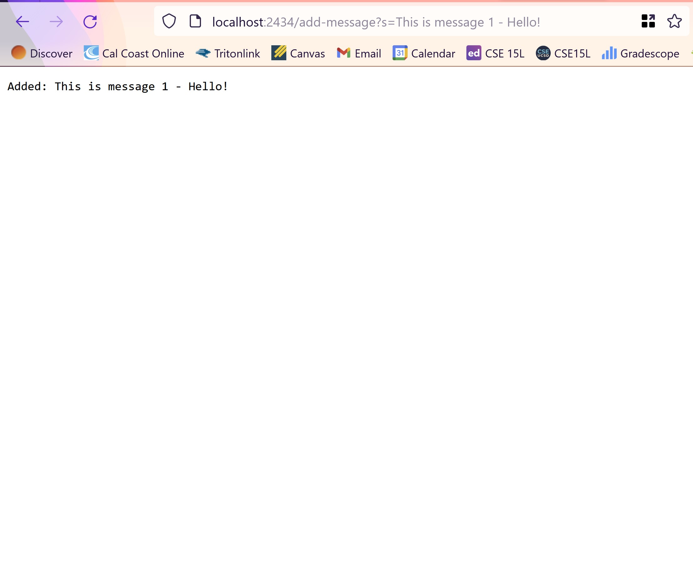
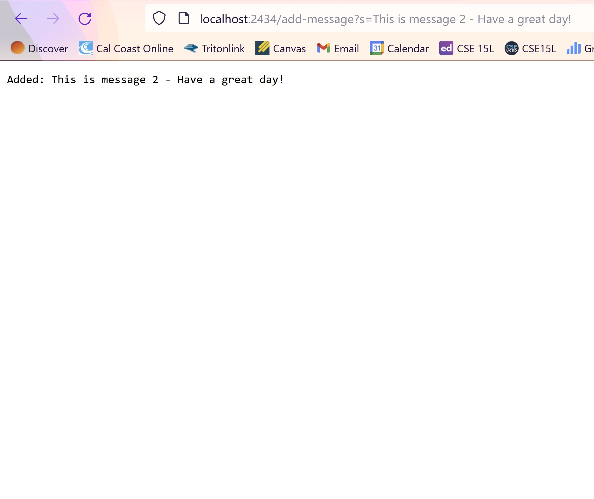

# Lab Report 2
## Part 1

### Code
Note: I used and altered the code from Lab 2.
```
import java.io.IOException;
import java.net.URI;
import java.util.ArrayList;

class Handler implements URLHandler {
    ArrayList<String> strings = new ArrayList<>();

    public String handleRequest(URI url) {
        String ArrayAsString = String.join("\n", strings);
        if (url.getPath().equals("/")) {
            return ArrayAsString;
        } else {
            System.out.println("Path: " + url.getPath());
            if (url.getPath().contains("/add-message")) {
                String[] parameters = url.getQuery().split("=");
                strings.add(parameters[1]);
                return String.format("Added: %s", parameters[1]);
            }
            return "404 Not Found!";
        }
    }
}

class StringServer {
    public static void main(String[] args) throws IOException {
        if(args.length == 0){
            System.out.println("Missing port number! Try any number between 1024 to 49151");
            return;
        }

        int port = Integer.parseInt(args[0]);

        Server.start(port, new Handler());
    }
}

```


Methods Used: handleRequest()
* URL: localhost/2434
* parameters[1]: This is Message 1 - Hello!
* ArrayAsString: "This is Message 1 - Hello!"



Methods Used: handleRequest()
* URL: localhost/2434
* parameters[1]: This is Message 2 - Have A Great Day!
* ArrayAsString: "This is Message 1 - Hello! \n This is Message 2 - Have A Great Day!"
