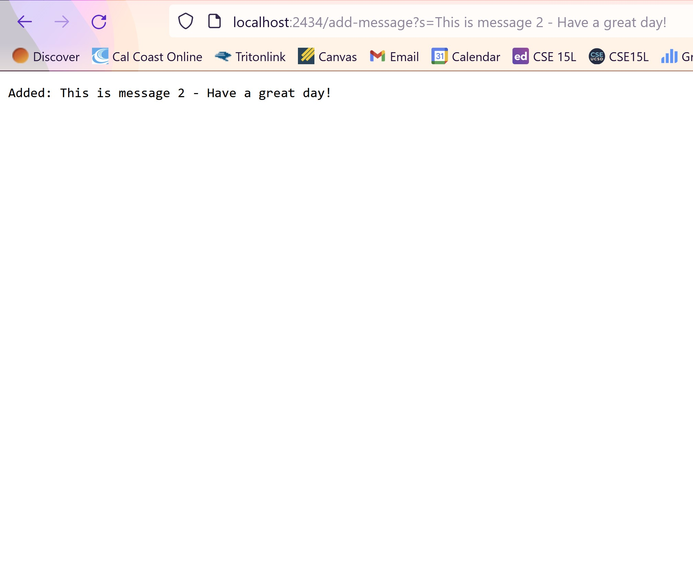

# Lab Report 2
## Part 1

### Code
Note: I used and altered the code from Lab 2.
```
import java.io.IOException;
import java.net.URI;
import java.util.ArrayList;

class Handler implements URLHandler {
    ArrayList<String> strings = new ArrayList<>();

    public String handleRequest(URI url) {
        String ArrayAsString = String.join("\n", strings);
        if (url.getPath().equals("/")) {
            return ArrayAsString;
        } else {
            System.out.println("Path: " + url.getPath());
            if (url.getPath().contains("/add-message")) {
                String[] parameters = url.getQuery().split("=");
                strings.add(parameters[1]);
                return String.format("Added: %s", parameters[1]);
            }
            return "404 Not Found!";
        }
    }
}

class StringServer {
    public static void main(String[] args) throws IOException {
        if(args.length == 0){
            System.out.println("Missing port number! Try any number between 1024 to 49151");
            return;
        }

        int port = Integer.parseInt(args[0]);

        Server.start(port, new Handler());
    }
}

```


Methods Used: handleRequest()
* Fields & Arguments:
  * strings: [This is message 1 - Hello!]
    * strings is an array list that stores each added string from the URL.
  * ArrayAsString: "This is message 1 - Hello!"
    * ArrayAsString displays all added strings as a string with a new line in between each string on the homepage.
  * URL: localhost/2434/add-message?s=This is message 1 - Hello!
    * URL is the argument used for the handleRequest() method. It represents the URL of the webpage and will be used to determine which actions to take in the method.
  * parameters: [localhost/2434/add-message?s, This is message 1 - Hello!]
    * parameters is an array list used to store the query and subsequent string to be added to the webpage. The query, also known as parameters[1], will be added to strings.
* All of the fields except ArrayAsString are changed when using the following path and query in the URL. The method handleRequest() is called each time the webpage is reloaded and the path/query determine what message is displayed. Since the path is "/add-message", the local variable parameters is created. The string at index 1 of parameters is added to the array list, strings. ArrayAsString is not changed when the URL is called because its argument does not rely on the parameter for handleRequest().




Methods Used: handleRequest()
* Fields & Arguments:
  * strings: [This is message 1 - Hello!, This is message 2 - Have a great day!]
    * strings is an array list that stores each added string from the URL.
  * ArrayAsString: "This is message 1 - Hello! \n This is message 2 - Have a great day!"
    * ArrayAsString displays all added strings as a string with a new line in between each string on the homepage.
  * URL: localhost/2434/add-message?s=This is message 2 - Have a great day!
    * URL is the argument used for the handleRequest() method. It represents the URL of the webpage and will be used to determine which actions to take in the method.
  * parameters: [localhost/2434/add-message?s, This is message 2 - Have a great day!]
    * parameters is an array list used to store the query and subsequent string to be added to the webpage. The query, also known as parameters[1], will be added to strings.
* All of the fields except ArrayAsString are changed when using the following path and query in the URL. The method handleRequest() is called each time the webpage is reloaded and the path/query determine what message is displayed. Since the path is "/add-message", the local variable parameters is created. The string at index 1 of parameters is added to the array list, strings. ArrayAsString is not changed when the URL is called because its argument does not rely on the parameter for handleRequest().

Home Page:


## Part 2
Bug:
```
  // Returns a *new* array with all the elements of the input array in reversed
  // order
  static int[] reversed(int[] arr) {
    int[] newArray = new int[arr.length];
    for(int i = 0; i < arr.length; i += 1) {
      arr[i] = newArray[arr.length - i - 1];
    }
    return arr;
  }
```
Failure-Inducing Input:
```
int[] input2 = { 2, 4, 6, 8};
assertArrayEquals(new int[]{ 8, 6, 4, 2 }, ArrayExamples.reversed(input2));
```
Non-Failure-Inducing Input:
```
int[] input3 = { 0, 0, 0 };
assertArrayEquals(new int[]{ 0, 0, 0 }, ArrayExamples.reversed(input3));
```
Symptom:


Bug Before Fixing:
```
  static int[] reversed(int[] arr) {
    int[] newArray = new int[arr.length];
    for(int i = 0; i < arr.length; i += 1) {
      arr[i] = newArray[arr.length - i - 1];  //This line is the bug!
    }
    return arr;  //This line is also the bug!
  }
```

Bug After Fixing:
```
  static int[] reversed(int[] arr) {
    int[] newArray = new int[arr.length];
    for(int i = 0; i < arr.length; i += 1) {
      newArray[i] = arr[arr.length - i - 1];
    }
    return newArray;
  }
```

Before fixing the bug, the reversed() method would make a new integer array the same length as arr with the default values of 0 in each index. Since all of the values in the new array is 0, the for loop assigns each index in the original array to 0, starting from the last index in the new array. Finally, it would return the original array with all of its changed values.

This fix addresses the issues above in multiple ways. First, the goal was to create a new array that would be the reverse of the original index. So, I changed the body of the for loop to assign each index of the new array, starting from the first index, to a value in the original array, starting from the last index. Then, I returned to new array since that contains the reversed values of the original index.

## Part 3
Something I learned from Lab 2 is the functions of the URLHandler interface and using it to read input from URLs and responding with strings. I did not know it was possible to start a web server this easily, so it surprised me to learn that the only code needed to start a web server was `Server.start(####, new Handler())`. Additionally, all of the code used to read the URL of web servers were taught in CSE 8A and 8B, such as if statements, arrays, and array lists. I also learned about the `%` formatting in Lab 2, which I thought was cool.


