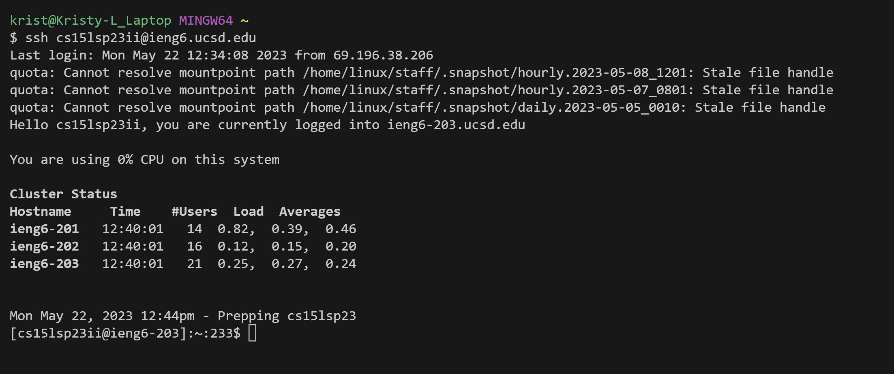

# Lab Report 4
## Step 1: Log into ieng6

Keys Pressed:
`s` `s` `h` `<CTRL-C>` "cs15lsp23ii@ieng6.ucsd.edu" `<CTRL-V>`
Note: I copied my username from a sticky note with my log-in info. Additionally, I did not need to input my password because I am generating SSH keys for my ieng6 account.

## Step 2: Clone your fork of the repository from your Github account

