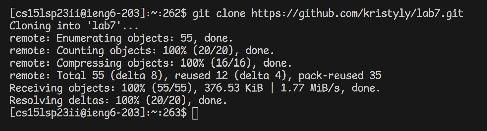

# Lab Report 4
Note: I have changed the font of my VSCode since my first submission, so some of the images have a different font.

## Step 1: Log into ieng6

Keys Pressed:

`s` `s` `h` `<SPACE>` `<CTRL-C>` "cs15lsp23ii@ieng6.ucsd.edu" `<CTRL-V>` `<ENTER>`

Note: I copied my username from a sticky note with my log-in info. Additionally, I did not need to input my password because I am generating SSH keys for my ieng6 account.

## Step 2: Clone your fork of the repository from your Github account

Keys Pressed:

"git clone https://github.com/kristyly/lab7.git" `<ENTER>`

## Step 3: Run the tests, demonstrating that they fail

Keys Pressed:

`c` `d` `<SPACE>` `l` `a` `b` `7` `<ENTER>`

`b` `a` `s` `h`  `<SPACE>` `t` `e` `s` `t` `.` `s` `h` `<ENTER>`

Note: Since the file is located in the lab7 repository, I needed to change my working directory to lab7. The command to run the program is also located in `test.sh`, so I decided to run the bash script instead of typing out the command.

## Step 4: Edit the code file to fix the failing test

Keys Pressed:

`v` `i` `m` `<SPACE>` `L` `i` `s` `t` `E` `x` `a` `m` `p` `l` `e` `s` `.` `j` `a` `v` `a` `<ENTER>`

Note: I am using vim to edit `ListExamples.java` through the terminal.

Keys Pressed:

`?` `i` `n` `d` `<ENTER>`

Note: This searches for the characters `ind` from the bottom of the document up.

Keys Pressed:

`e`

Note: This brings me to the end of the word.

Keys Pressed:

`r` `2`

Note: This replaces the character I am on, which is 1, with 2.

Keys Pressed: 

`:` `w` `q`

Note: This saves and exits the file.

## Step 4: Run the tests, demonstrating that they now succeed

Keys Pressed:

`<UP>` 2 times `<ENTER>`

Note: Since I had already used the command `bash test.sh`, I just needed to use the up arrow twice to find the same command to run.

## Step 5: Commit & Push

Keys Pressed:

`git commit -a` "Successful!" `:` `w` `q`

Note: To commit to the gitHub repository, I used the command above and used "Successful!" as my commit message. Then, I saved and exited using the command `:wq`

Note: Based on the message above, the resulting change was successfully pushed.
