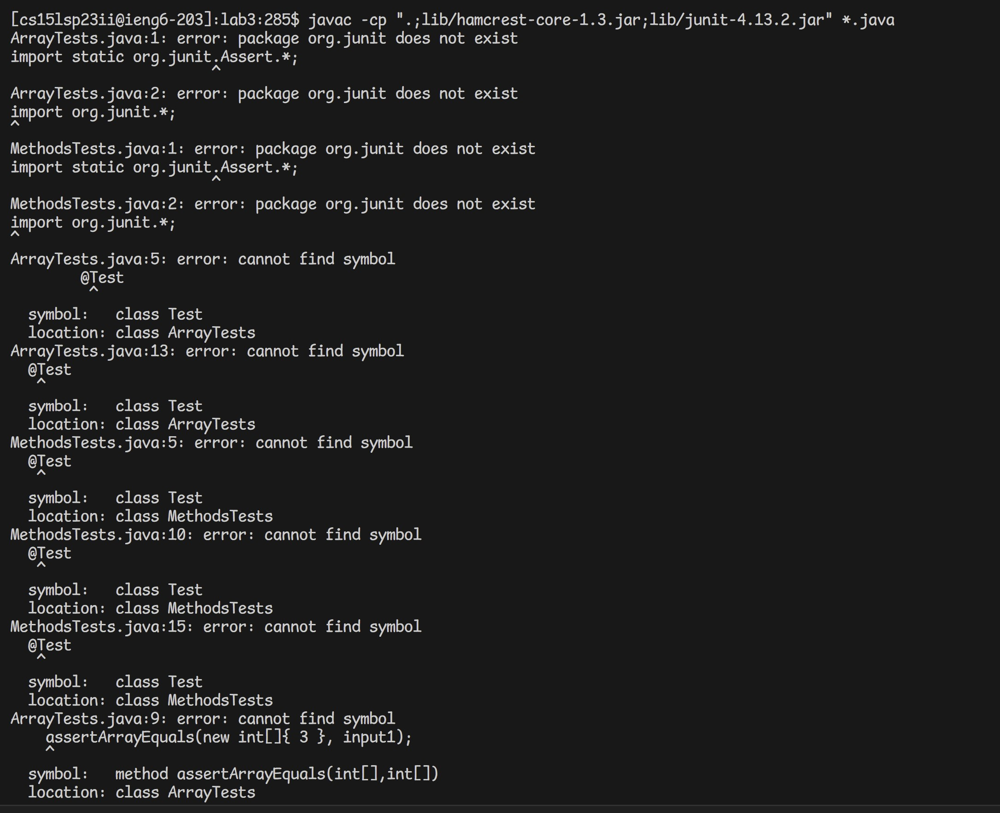
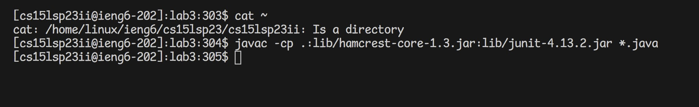

# Lab Report 5
## Part 1
### Debugging Scenario
What environment are you using (computer, operating system, web browser, terminal/editor, and so on)?

I am on the Windows operating system, VSCode.

Detail the symptom you're seeing. Be specific; include both what you're seeing and what you expected to see instead. Screenshots are great, copy-pasted terminal output is also great. Avoid saying “it doesn't work”.

I get an error on all of my JUnit tests.

Detail the failure-inducing input and context. That might mean any or all of the command you're running, a test case, command-line arguments, working directory, even the last few commands you ran. Do your best to provide as much context as you can.

The failure-inducing input is the JUnit compiler for all files ending in .java in lab3. `javac -cp ".;lib/hamcrest-core-1.3.jar;lib/junit-4.13.2.jar" *.java` I have all of lib in my lab and I am currently logged into my ieng6 computer.

### TA Response

The server ieng6.ucsd.edu is a remote computer separate from your personal laptop. You can use `cat ~` to check your operating system. Remember that linux is the operating system for Mac users and Windows is the operating system for Windows users. Now, what do you see and how does that affect your compiler?

### Student Response

The bug was that I was using the compiler command for a Windows operating system when I was on a linux computer. By getting rid of the quotation marks on the command, I was able to compile all my java files.

### Summary
* The file & directory structure needed - Lab 3, Windows Laptop, Logged into ieng6 account
* The contents of each file before fixing the bug - Content does not matter
* The full command line (or lines) you ran to trigger the bug - `javac -cp ".;lib/hamcrest-core-1.3.jar;lib/junit-4.13.2.jar" *.java`
* A description of what to edit to fix the bug - Change the terminal command to `javac -cp .;lib/hamcrest-core-1.3.jar;lib/junit-4.13.2.jar *.java`

## Part 2
Something I learned from labs are how servers work. I never knew how easy it was to make and run a basic server, so learning how to do that using mostly Java we learned from CSE 11 was surprising and interesting. I also learned about vim aka editing a file on the terminal and github, which I knew existed but had no idea how it worked. I think I will be using skills often in the future, so I'm glad I was able to learn it now. 

Finally, I learned that if you touch a person's elbow without them noticing, they won't feel it because there are very few nerves there. (Thanks Genevieve!)

